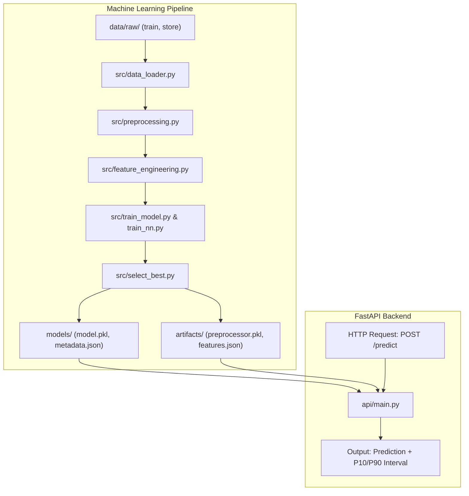

# Rossmann Store Sales Forecasting System

Production-grade machine learning system designed to forecast daily sales for over 1,115 Rossmann drug stores across Germany up to 6 weeks (42 days) in advance.

Built with a modular 3-layer architecture separating **Machine Learning**, **FastAPI Backend**, and **Deployment Integration**, adhering to [`ml_project_agent`](file:///C:/Users/dxt/.gemini/config/plugins/data-agent-kit-plugin/skills/ml_project_agent/SKILL.md) and [`ml_best_practices`](file:///C:/Users/dxt/.gemini/config/plugins/data-agent-kit-plugin/skills/ml_best_practices/SKILL.md).

---

## 1. Problem Statement & Business Objective

Store managers require accurate daily sales forecasts to optimize staff scheduling, supply chain delivery, and inventory turnover. 

* **Prediction Target**: Continuous daily `Sales` (EUR) per store.
* **Evaluation Metric**: Root Mean Square Percentage Error (**RMSPE**), penalizing relative percentage errors evenly across high-volume and low-volume stores:
  $$\text{RMSPE} = \sqrt{\frac{1}{n} \sum_{i=1}^n \left( \frac{y_i - \hat{y}_i}{y_i} \right)^2}$$
* **Forecast Horizon**: 42 days (6 weeks), matching the Rossmann store scheduling cycle.
* **Operational Constraint**: Closed store days (`Open == 0`, e.g., Sundays and public holidays) strictly yield zero sales.

---

## 2. Dataset Understanding & Preprocessing

The system utilizes three historical datasets located in `data/raw/`:
* `train.csv`: Daily historical sales and operational records from 2013-01-01 to 2015-07-31.
* `store.csv`: Store-specific metadata (store type, assortment, competition distance, promotional schedules).
* `test.csv`: 42-day future evaluation set (2015-08-01 to 2015-09-17).

### Key Data Preprocessing & Cleaning Rules
1. **Strict Leakage Prevention**:
   * The `Customers` feature is observed only after a trading day concludes and is absent from `test.csv`. It is strictly excluded from all feature sets.
   * `CompetitionDistance` is imputed using the median of known store distances.
   * Categorical features (`StoreType`, `Assortment`, `StateHoliday`, `PromoInterval`) are cleanly imputed and mapped via `OrdinalEncoder` fitted strictly on training data.
2. **Target Transformation**:
   * Target variable is modeled as $y_{\text{train}} = \log(1 + \text{Sales})$ to stabilize variance across store scales and naturally bound sales $\ge 0$.
   * Predictions are inverse-transformed at inference time: $\hat{y} = \max(0, \exp(\hat{y}_{\log}) - 1)$.
3. **Chronological Splitting**:
   * A strict 42-day temporal holdout (2015-06-20 to 2015-07-31) validates model generalization under real-world time-forward conditions.

---

## 3. Feature Engineering

Total feature set consists of **35 structured signals**:
* **Calendar & Temporal**: `Year`, `Month`, `Day`, `DayOfWeek`, `WeekOfYear`.
* **Store Operations & Promotions**: `Open`, `Promo`, `StateHoliday`, `SchoolHoliday`, `Promo2`, `Promo2SinceWeek`, `Promo2SinceYear`, `PromoInterval`.
* **Store Competition Dynamics**: `StoreType`, `Assortment`, `CompetitionDistance`, `CompetitionOpenSinceMonth`, `CompetitionOpenSinceYear`.
* **Autoregressive Lags & Rolling Trends**:
  * 14 daily lag signals: `Sales_lag_1` through `Sales_lag_14`.
  * 7-day rolling statistics: `Sales_rolling_mean_7`, `Sales_rolling_std_7`.

---

## 4. Model Exploration & Benchmarking

Following [`ml_best_practices`](file:///C:/Users/dxt/.gemini/config/plugins/data-agent-kit-plugin/skills/ml_best_practices/SKILL.md), multiple candidate architectures were benchmarked against a seasonal naive baseline on the exact same 42-day chronological validation set:

| Model | MAE (EUR) | RMSE (EUR) | RMSPE | Architecture Type | Selection Status |
| :--- | :---: | :---: | :---: | :--- | :---: |
| **LGBMRegressor** | **549.91** | **757.84** | **0.1070** | Gradient Boosted Trees | 🏆 **Production Winner** |
| **XGBRegressor** | 548.82 | 761.27 | 0.1080 | Gradient Boosted Trees | Runner-up |
| **RandomForestRegressor** | 574.28 | 816.03 | 0.1124 | Bagged Ensembles | Candidate |
| **Ridge Regression** | 822.23 | 1161.18 | 0.1759 | Regularized Linear | ML Baseline |
| **nn_embedding** | 2230.63 | 2733.08 | 0.3569 | Deep Learning (Embeddings) | Deep Model |
| **Seasonal Naive ($Sales_{t-7}$)** | 2169.49 | 2767.41 | 0.4189 | Historical Lag Rule | Naive Baseline |
| **nn_mlp** | 3327.35 | 3912.21 | 0.5458 | Deep MLP | Deep Model |

### Uncertainty Estimation (Prediction Intervals)
In addition to point forecasts, the system trains dual **LightGBM Quantile Regressors** at $\alpha=0.10$ and $\alpha=0.90$:
* **Coverage**: 66.6% empirical validation coverage (nominal 80%).
* **Mean Interval Width**: 1,376.74 EUR.

All winning artifacts are saved to `models/model.pkl`, `models/quantile_models.pkl`, and `models/metadata.json`.

---

## 5. System Architecture



---

## 6. API Reference (`api/main.py`)

### 1. Health Check
* **Endpoint**: `GET /health`
* **Response**:
```json
{
  "status": "healthy",
  "artifacts_loaded": true,
  "model_name": "LGBMRegressor",
  "model_type": "sklearn",
  "target_transform": "log1p"
}
```

### 2. Model Metadata & Metrics
* **Endpoint**: `GET /metadata`
* **Description**: Returns full validation metrics, hyperparameter context, feature lists, and training date ranges.

### 3. Predict Sales
* **Endpoint**: `POST /predict`
* **Request Payload**:
```json
{
  "data": [
    {
      "Store": 1,
      "DayOfWeek": 5,
      "Date": "2015-07-31",
      "Open": 1,
      "Promo": 1,
      "StateHoliday": "0",
      "SchoolHoliday": 1,
      "StoreType": "c",
      "Assortment": "a",
      "CompetitionDistance": 1270.0
    },
    {
      "Store": 1,
      "DayOfWeek": 7,
      "Date": "2015-08-02",
      "Open": 0,
      "Promo": 0
    }
  ]
}
```

* **Response Payload**:
```json
{
  "predictions": [5229.92, 0.0],
  "results": [
    {
      "store": 1,
      "date": "2015-07-31",
      "prediction": 5229.92,
      "prediction_interval_p10": 3233.86,
      "prediction_interval_p90": 5442.68,
      "open": 1
    },
    {
      "store": 1,
      "date": "2015-08-02",
      "prediction": 0.0,
      "prediction_interval_p10": 0.0,
      "prediction_interval_p90": 0.0,
      "open": 0
    }
  ],
  "model_name": "LGBMRegressor"
}
```

---

## 7. Local Development & Testing

### 1. Prerequisites
* Python 3.10+ (tested on Python 3.11)

### 2. Installation
```bash
cd Sales_Forecasting
pip install -r requirements.txt
```

### 3. Run Test Suite
```bash
pytest tests/test_api.py -v
```

### 4. Run API Locally
```bash
uvicorn api.main:app --host 0.0.0.0 --port 8000 --reload
```
Interactive Swagger documentation is available at `http://localhost:8000/docs`.

### 5. Re-run Training Pipeline
```bash
python src/train.py
```

---

## 8. Deployment (Railway)

The application includes production configuration ready for **Railway**:
* `Procfile`:
  ```
  web: uvicorn api.main:app --host 0.0.0.0 --port $PORT
  ```
* **CORS Middleware**: Enabled in `api/main.py` allowing frontend client connections.
* **Memory & Startup Optimization**: The production model is serialized using LightGBM and Joblib, loading instantaneously with sub-millisecond per-row inference latency.
